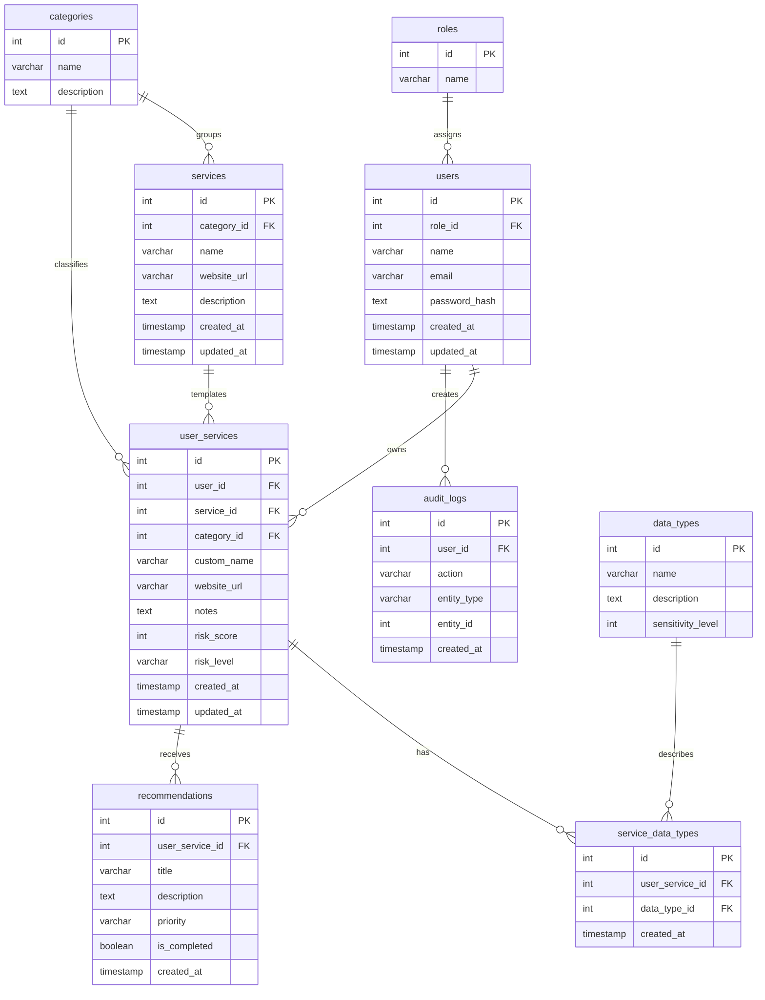

# PrivacyMap ER Diagram

```mermaid
erDiagram
    roles ||--o{ users : assigns
    users ||--o{ user_services : owns
    users ||--o{ audit_logs : creates
    categories ||--o{ services : groups
    categories ||--o{ user_services : classifies
    services ||--o{ user_services : templates
    user_services ||--o{ service_data_types : has
    data_types ||--o{ service_data_types : describes
    user_services ||--o{ recommendations : receives

    roles {
        int id PK
        varchar name
    }

    users {
        int id PK
        int role_id FK
        varchar name
        varchar email
        text password_hash
        timestamp created_at
        timestamp updated_at
    }

    categories {
        int id PK
        varchar name
        text description
    }

    services {
        int id PK
        int category_id FK
        varchar name
        varchar website_url
        text description
        timestamp created_at
        timestamp updated_at
    }

    user_services {
        int id PK
        int user_id FK
        int service_id FK
        int category_id FK
        varchar custom_name
        varchar website_url
        text notes
        int risk_score
        varchar risk_level
        timestamp created_at
        timestamp updated_at
    }

    data_types {
        int id PK
        varchar name
        text description
        int sensitivity_level
    }

    service_data_types {
        int id PK
        int user_service_id FK
        int data_type_id FK
        timestamp created_at
    }

    recommendations {
        int id PK
        int user_service_id FK
        varchar title
        text description
        varchar priority
        boolean is_completed
        timestamp created_at
    }

    audit_logs {
        int id PK
        int user_id FK
        varchar action
        varchar entity_type
        int entity_id
        timestamp created_at
    }
```
